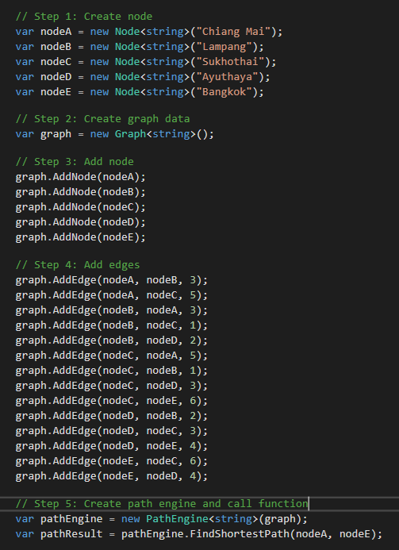

# Dijkstra-Library
Dijkstra's algorithm for finding the shortest paths between nodes in a graph using priority queue.

## Pseudo Code

## Example Data

## Example Usage

## References
* Dijkstra's algorithm - [Wikipedia Dijkstra's algorithm](https://en.wikipedia.org/wiki/Dijkstra%27s_algorithm)
* Priority Queue - [High Speed Priority Queue for C#](https://github.com/BlueRaja/High-Speed-Priority-Queue-for-C-Sharp)
