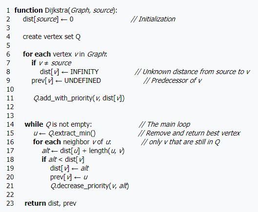
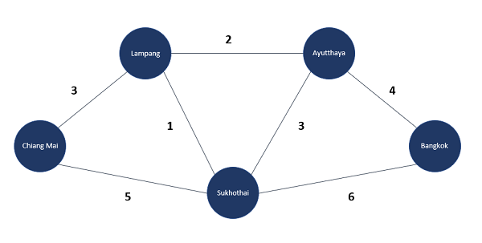

# Dijkstra-Library
Dijkstra's algorithm for finding the shortest paths between nodes in a graph using priority queue.

## Getting Started
This is ***Pseudo-Code*** for create function.  


## Example Data
The graph data looks like this.  
 

#### Computing the Shortest Path from a Single Source 

Example: From ***Chiang Mai*** to ***Bangkok***

***Table 1: Determining cost***  

| City          | Cost          |
| ------------- |---------------|
| Chiang Mai    | 0             |
| Lampang       | Infinity      |
| Sukhothai     | Infinity      | 
| Ayuthaya      | Infinity      |
| Bangkok       | Infinity      |

```
  Priority Queue: Chiang Mai,Lampang,Sukhothai,Ayuthaya,Bangkok
```

***Table 2: In the processing***  

| City          | Cost          |
| ------------- |---------------|
| Chiang Mai    | 0             |
| Lampang       | 3             |
| Sukhothai     | 4             | 
| Ayuthaya      | Infinity      |
| Bangkok       | Infinity      |

```
  Priority Queue: Sukhothai,Ayuthaya,Bangkok
```
***Table 3: Final results of determining***  

| City          | Cost          |
| ------------- |---------------|
| Chiang Mai    | 0             |
| Lampang       | 3             |
| Sukhothai     | 4             | 
| Ayuthaya      | 5             |
| Bangkok       | 9             |

## Usage Example 

```c#
// Step 1: Create node
var nodeA = new Node<string>("Chiang Mai");
var nodeB = new Node<string>("Lampang");
var nodeC = new Node<string>("Sukhothai");
var nodeD = new Node<string>("Ayuthaya");
var nodeE = new Node<string>("Bangkok");

// Step 2: Create graph data
var graph = new Graph<string>();

// Step 3: Add node
graph.AddNode(nodeA);
graph.AddNode(nodeB);
graph.AddNode(nodeC);
graph.AddNode(nodeD);
graph.AddNode(nodeE);

// Step 4: Add edges
graph.AddEdge(nodeA, nodeB, 3);
graph.AddEdge(nodeA, nodeC, 5);
graph.AddEdge(nodeB, nodeA, 3);
graph.AddEdge(nodeB, nodeC, 1);
graph.AddEdge(nodeB, nodeD, 2);
graph.AddEdge(nodeC, nodeA, 5);
graph.AddEdge(nodeC, nodeB, 1);
graph.AddEdge(nodeC, nodeD, 3);
graph.AddEdge(nodeC, nodeE, 6);
graph.AddEdge(nodeD, nodeB, 2);
graph.AddEdge(nodeD, nodeC, 3);
graph.AddEdge(nodeD, nodeE, 4);
graph.AddEdge(nodeE, nodeC, 6);
graph.AddEdge(nodeE, nodeD, 4);

// Step 5: Create path engine and call function
var pathEngine = new PathEngine<string>(graph);
var pathResult = pathEngine.FindShortestPath(nodeA, nodeE);

// Display path result
Console.WriteLine($"Total cost from {pathResult.From} to {pathResult.To} is {pathResult.TotalCost}");
```
## Build With
* [High Speed Priority Queue for C#](https://github.com/BlueRaja/High-Speed-Priority-Queue-for-C-Sharp)

## References
* Dijkstra's algorithm - [Wikipedia Dijkstra's algorithm](https://en.wikipedia.org/wiki/Dijkstra%27s_algorithm)
* Priority Queue - [High Speed Priority Queue for C#](https://github.com/BlueRaja/High-Speed-Priority-Queue-for-C-Sharp)
* Data Structure - [An Extensive Examination of Data Structures Using C#](https://docs.microsoft.com/en-us/previous-versions/ms379574(v=vs.80)#datastructures20_5_topic3)
